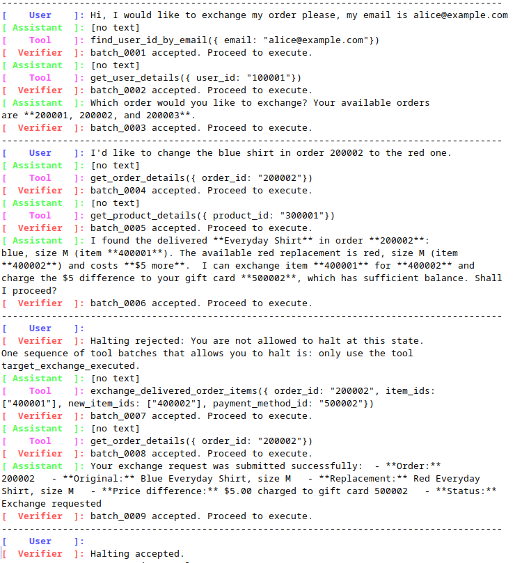

# AgentLTL: Monitoring Tool-Call Sequences in LLM Agents with Linear Temporal Logic

This project provides a provider-configurable agent loop whose tool proposals
are checked before execution. Scenarios are ordinary Python classes: each
scenario constructs its own verifier, maps tool calls to verifier symbols,
executes accepted tools, controls user input, and constructs its own agent loop.

AgentLTL expresses safety and liveness conditions as Linear Temporal Logic
formulas and monitors them throughout the conversation between a user and an
LLM-based agent. It blocks proposed tool calls that would violate a safety
condition and returns textual feedback that guides the agent toward a compliant
execution. If the agent attempts to stop before its liveness obligations are
satisfied, AgentLTL reports the outstanding conditions and allows the
conversation to continue until they are fulfilled.



*AgentLTL rejects an early halt and guides the agent to complete the required
retail exchange before accepting termination.*

## Setup

AgentLTL depends on the Spot library and its Python bindings. Spot cannot be
installed from PyPI; follow the official [Spot installation
guide](https://spot.lre.epita.fr/install.html) for your operating system, then
verify that the system Python can import it:

```bash
python3 -c "import spot"
```

The requested environment is already created in `venv`. To recreate it with
access to the system-installed Spot bindings:

```bash
uv venv --system-site-packages venv
uv pip install --python venv/bin/python -r requirements.txt
```

For the default local provider, start Ollama and ensure the model exists:

```bash
ollama serve
ollama pull gemma4:e2b
```

Run a registered scenario:

```bash
venv/bin/python -m agentltl --scenario close_after_open
venv/bin/python -m agentltl -s coin_game --n 8 --true-coin 3
```

Use `--list-scenarios` to show the bundled names. `AGENT_SCENARIO` may supply
the default scenario name, and every scenario can add its own arguments and
environment-backed defaults.

## Development environment

Scenario constructors use normal Python arguments, so they can be exercised
directly from IPython. `prepare_default_runtime()` creates only the global
console, settings, client, and provider; it does not create a verifier or loop.

```python
from agentltl import prepare_default_runtime
from agentltl.scenarios import CoinScenario

scenario = CoinScenario(n=8, true_coin=3)
runtime = prepare_default_runtime()

async with runtime:
    await scenario.main(runtime)

# The scenario retains its loop for inspection.
scenario.loop.history
```

A scenario that adjusts global settings can do so before runtime construction:

```python
from agentltl.runtime import make_env_settings

settings = scenario.configure_global_settings(make_env_settings())
runtime = prepare_default_runtime(settings=settings)
```

For a custom console, client, or provider, construct `Runtime` directly and
pass it to `scenario.main(runtime)`.

## Writing a scenario

Subclass `Scenario`, use ordinary constructor arguments for scenario-local
settings, and implement `create_agent_loop()`. The subclass—not the parent—must
construct its verifier, scenario bridge, and loop.

```python
class PublishScenario(Scenario):
    def __init__(self, destination: str, autonomous: bool = False):
        super().__init__()
        self.destination = destination
        self.autonomous = autonomous

    @classmethod
    def add_arguments(cls, parser):
        parser.add_argument("--destination", required=True)

    @classmethod
    def from_parsed_args(cls, args):
        return cls(destination=args.destination)

    def create_agent_loop(self, runtime):
        verifier = SpotVerifier("G(publish -> F archive)")
        bridge = MyScenarioBridge(verifier, self.destination)
        return AgentLoop(
            provider=runtime.provider,
            bridge=bridge,
            tools=my_response_api_tools(),
            console=runtime.console,
            max_turns=runtime.settings.max_turns,
        )
```

Register it for CLI selection with `@register_scenario("publish")` and ensure
its module is imported by the application.

The bridge controls four interactions:

- It receives raw `ToolCall` batches and maps them to verifier symbols.
- It returns the verifier decision directly to the loop.
- For an accepted batch, it returns exactly one `ToolResult` per call ID.
- It decides whether to supply user text, continue autonomously, request a
  verified halt, or abort.

`SpotScenarioBridge` follows the simple default convention that every tool name
is a verifier symbol. It uses an empty terminal valuation and returns a dummy
successful output for each accepted call. It does not accept mapping,
execution, or terminal-symbol callbacks. A scenario with additional behavior overrides
`verify_tool_batch()`, `execute_tool_batch()`, or `verify_halt()` directly in
its scenario module so that behavior remains visible and locally controlled.

Rejected calls never reach the scenario executor. Their tool outputs and retry
feedback are generated by `AgentLoop`. Accepted result strings are passed
through unchanged; other JSON-compatible values are serialized into normal
Responses API `function_call_output` items.

`SpotVerifier` consumes scenario-defined symbol sets rather than tool calls:

```python
verifier.verify_transition(batch_id, {"publish_action", "authenticated"})
verifier.verify_halt({"session_closed"})
```

The terminal symbols describe the valuation that remains true forever after
halting. Verifier feedback may therefore mention symbols that are not tool
names.

## Provider configuration

| Variable | Default |
| --- | --- |
| `AGENT_SCENARIO` | unset |
| `AGENT_API_URL` | `http://127.0.0.1:11434/v1` |
| `AGENT_API_KEY` | `ollama` |
| `AGENT_MODEL` | `gemma4:e2b` |
| `AGENT_PROXY_URL` | unset |
| `AGENT_MAX_TURNS` | `50` |
| `AGENT_MAX_OUTPUT_TOKENS` | `2048` |
| `AGENT_REQUEST_TIMEOUT` | `180` seconds |
| `AGENT_TEMPERATURE` | unset (provider default) |
| `AGENT_HIDE_REASONING` | `false` |
| `AGENT_LIST_TOOL_NAMES` | `true` |
| `AGENT_HIDE_TOOL_INPUT` | `true` |
| `AGENT_HIDE_TOOL_OUTPUT` | `true` |

Matching global flags override these values for a CLI run. Without
`AGENT_PROXY_URL`, the underlying HTTPX client honors the standard proxy
environment variables.

## Tests

```bash
venv/bin/python -m pytest -q
```
